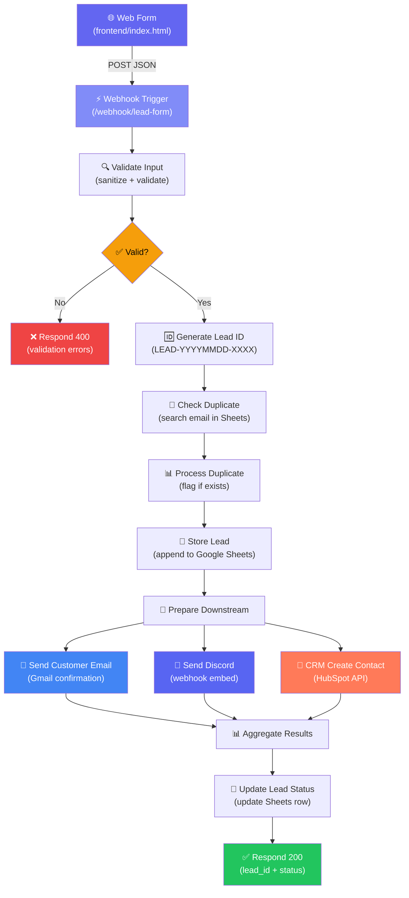
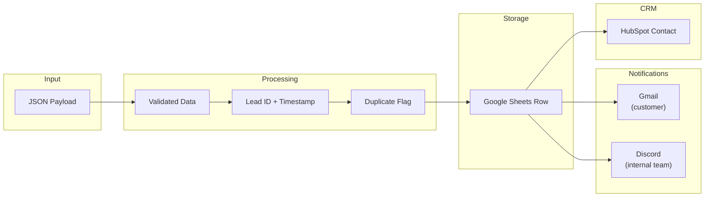
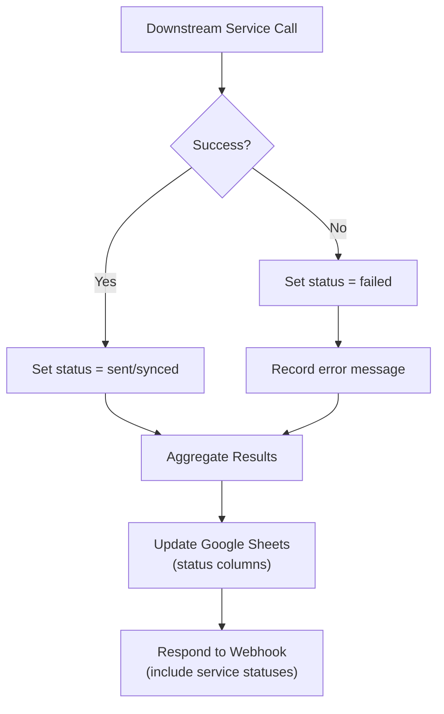

# Workflow Diagram — Lead Management System

## High-Level Flow

## Data Flow

## Error Handling Flow

## Node Reference

| # | Node | Type | Purpose |
|---|------|------|---------|
| 1 | Webhook Trigger | `webhook` | Receives POST from frontend form |
| 2 | Validate Input | `code` | Server-side validation + sanitization |
| 3 | Is Valid? | `if` | Routes valid vs. invalid payloads |
| 4 | Respond Validation Error | `respondToWebhook` | Returns 400 with error details |
| 5 | Generate Lead ID | `code` | Creates unique ID + ISO timestamp |
| 6 | Check Duplicate | `googleSheets` (search) | Looks up existing leads by email |
| 7 | Process Duplicate Check | `code` | Flags duplicates, sets status |
| 8 | Store Lead in Sheets | `googleSheets` (append) | Writes full lead row |
| 9 | Prepare Downstream | `code` | Checks store result, passes data forward |
| 10 | Send Customer Email | `gmail` | HTML confirmation email to customer |
| 11 | Send Discord Notification | `httpRequest` | Rich embed to Discord channel |
| 12 | CRM Create Contact | `httpRequest` | Creates contact in HubSpot CRM |
| 13 | Aggregate Results | `code` | Collects statuses from all services |
| 14 | Update Lead Status | `googleSheets` (update) | Updates status columns in sheet |
| 15 | Respond Success | `respondToWebhook` | Returns 200 with lead_id + statuses |
