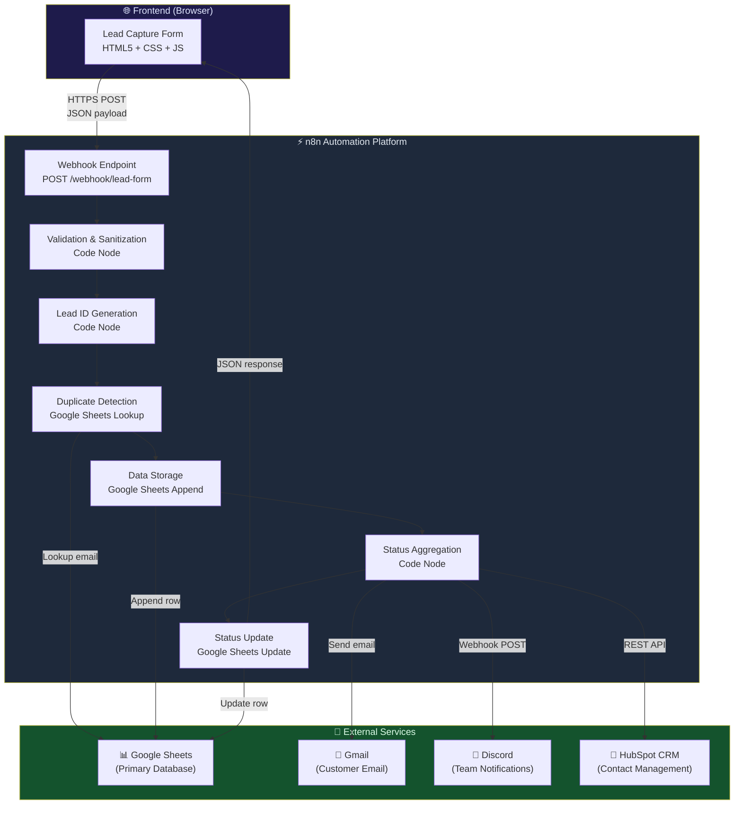
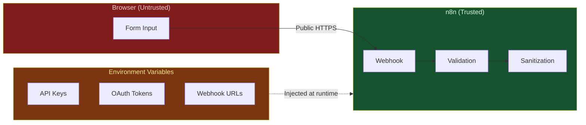
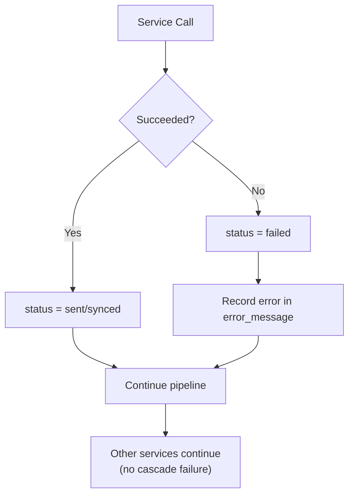
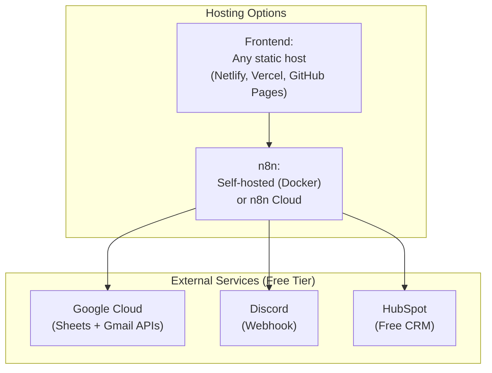

# System Architecture — Lead Management System

## Overview

The Lead Management System is a webhook-driven automation pipeline that captures leads from a web form, processes them through n8n, and distributes data to Google Sheets, Gmail, Discord, and HubSpot CRM.

## Architecture Diagram



## Component Details

### 1. Frontend (Client-Side)

| Aspect | Detail |
|--------|--------|
| **Tech** | HTML5, CSS3, Vanilla JavaScript |
| **Files** | `frontend/index.html`, `css/styles.css`, `js/app.js`, `js/config.js` |
| **Responsibility** | Form rendering, client-side validation, submission via `fetch()` |
| **Security** | No secrets in client code. Input sanitization for XSS prevention. |

The frontend performs **UX-only** validation. The server (n8n) re-validates everything.

### 2. n8n Automation Workflow

| Aspect | Detail |
|--------|--------|
| **Trigger** | HTTP Webhook (POST) |
| **Nodes** | 15 nodes total |
| **Error Handling** | `onError: continueRegularOutput` on all external service nodes |
| **Response** | Always responds to webhook (success with statuses, or 400 for validation) |

**Processing Pipeline:**

1. **Webhook Trigger** — Receives JSON payload from frontend
2. **Validate Input** — Server-side validation + HTML entity sanitization
3. **Is Valid?** — Routes valid/invalid payloads
4. **Generate Lead ID** — Creates `LEAD-YYYYMMDD-XXXX` + ISO timestamp
5. **Check Duplicate** — Searches Google Sheets for existing email
6. **Process Duplicate Check** — Flags duplicate leads
7. **Store Lead** — Appends complete row to Google Sheets
8. **Prepare Downstream** — Checks store result, passes data forward
9. **Send Customer Email** — Professional HTML confirmation via Gmail
10. **Send Discord Notification** — Rich embed via Discord webhook
11. **CRM Create Contact** — Creates contact in HubSpot
12. **Aggregate Results** — Collects status from all 3 services
13. **Update Lead Status** — Updates status columns in Google Sheets
14. **Respond Success** — Returns JSON with lead_id and service statuses

### 3. Google Sheets (Primary Database)

| Aspect | Detail |
|--------|--------|
| **Sheet Tab** | `Leads` |
| **Columns** | 14 (lead_id through error_message) |
| **Operations** | Search (duplicate), Append (store), Update (status) |
| **Auth** | OAuth2 via n8n credential |

### 4. Gmail (Customer Email)

| Aspect | Detail |
|--------|--------|
| **Purpose** | Professional HTML confirmation email to the customer |
| **Content** | Greeting, submission summary table, reference ID |
| **Auth** | OAuth2 via n8n Gmail credential |

### 5. Discord (Internal Notifications)

| Aspect | Detail |
|--------|--------|
| **Purpose** | Real-time sales team notification |
| **Format** | Rich embed with all lead fields |
| **Auth** | Webhook URL (no separate auth needed) |

### 6. HubSpot CRM

| Aspect | Detail |
|--------|--------|
| **Purpose** | Create/track contacts in CRM |
| **API** | `POST /crm/v3/objects/contacts` |
| **Auth** | Bearer token (Private App access token) |
| **Modularity** | Uses HTTP Request node — CRM endpoint is configurable |

## Security Architecture



### Security Principles

1. **No secrets in frontend** — `config.js` contains only the public webhook URL
2. **Server-side validation** — n8n re-validates all inputs (never trusts client)
3. **Input sanitization** — HTML entities escaped server-side to prevent XSS/injection
4. **Environment variables** — All credentials via env vars or n8n credential store
5. **CORS** — Webhook configured with `allowedOrigins` (restrict in production)
6. **HTTPS** — All external API calls use HTTPS
7. **Credential isolation** — n8n stores credentials encrypted at rest

### CORS Configuration

The n8n webhook is configured with `"allowedOrigins": "*"` for development. For production:

1. Set `allowedOrigins` to your frontend domain only
2. Enable webhook authentication in n8n (Basic Auth or Header Auth)
3. Use a reverse proxy (Nginx/Caddy) with rate limiting

## Error Handling Architecture



### Key Principles

1. **Graceful degradation** — If one service fails, others continue
2. **Status tracking** — Every service result is recorded in Google Sheets
3. **Error messages** — Specific error messages stored in `error_message` column
4. **No silent failures** — Every failure is logged and visible
5. **Webhook always responds** — Frontend always gets a response (200 or 400)

## Data Flow

### Webhook Payload (Input)
```json
{
  "name": "John Doe",
  "email": "john@acme.com",
  "phone": "+1 555-123-4567",
  "company": "Acme Inc.",
  "service": "AI & Automation Consulting",
  "budget": "$5,000 – $10,000",
  "message": "We need help automating our sales pipeline."
}
```

### Webhook Response (Output)
```json
{
  "success": true,
  "lead_id": "LEAD-20260910-A3F2",
  "status": "new",
  "is_duplicate": false,
  "message": "Thank you! Your inquiry has been received.",
  "services": {
    "email": "sent",
    "notification": "sent",
    "crm": "synced"
  }
}
```

## Deployment Architecture


